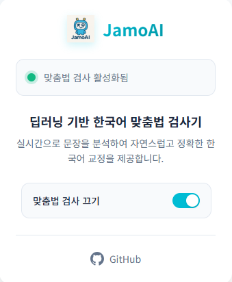

<table>
<tr>
<td width="80">
  
</td>
<td>
  <h2 style="margin-left: 10px;">JamoAI – 딥러닝 기반 한국어 맞춤법 검사기</h2>
</td>
</tr>
</table>

## 1. 프로젝트명

**JamoAI**는 딥러닝 기반 한국어 맞춤법 교정 시스템으로, ET5 모델(`j5ng/et5-typos-corrector`)을 이용해 자연스럽고 정확한 문장 교정을 제공합니다.

---

## 2. 프로젝트 설명

JamoAI는 사용자가 입력한 문장을 실시간으로 받아들이고, 한국어 맞춤법 및 문법 오류를 딥러닝 기반의 ET5 모델을 통해 자동으로 교정하는 시스템입니다.  
주요 특징은 아래와 같습니다:

- 사용자는 Chrome 확장 혹은 웹 입력창에서 문장을 입력
- Cloudtype 서버가 프록시 역할을 하여 외부 요청을 받아 처리
- 실질적인 연산은 로컬 GPU 서버에서 실행 (ET5 모델 기반)
- 실시간으로 교정 결과를 반환

이 방식은 무료로 안정적인 외부 API 엔드포인트를 유지하면서도 고성능 딥러닝 모델을 로컬에서 사용해 비용과 성능을 절충합니다.

---

## 3. 목차

1. 프로젝트명  
2. 프로젝트 설명  
3. 목차  
4. 프로젝트 설치 및 실행 방법  
5. 프로젝트 사용 방법  
6. 프론트엔드 예시 화면
7. 장점과 단점  
8. 팀원 및 참고 자료  
9. 라이센스  

---

## 4. 프로젝트 설치 및 실행 방법

### ✅ 로컬 GPU 서버 실행 (ET5)

```bash
git clone https://github.com/yourname/jamoai.git
cd jamoai

# 가상환경 생성 및 라이브러리 설치
pip install -r requirements.txt

# ngrok 설치 (https://ngrok.com/download)
./ngrok http 8000  # 또는 ngrok http --region=ap 8000

# ET5 서버 실행
python ngrok_starter.py
```

### ✅ Cloudtype 서버 (중계 서버)

- Cloudtype에서 FastAPI 서버를 배포하고
- ngrok 주소를 통해 로컬 서버로 요청을 전달

```python
@app.post("/spellcheck")
async def forward(req: TextRequest):
    return await httpx.post("https://<your-ngrok-url>.ngrok.io/spellcheck", json={"text": req.text})
```

---

## 5. 프로젝트 사용 방법

### ✨ 실시간 맞춤법 교정 사용 예시

```bash
POST /spellcheck
Body: { "text": "이거슨 틀린 문장입니당." }

Response:
{ "result": "이것은 틀린 문장입니다." }
```

### 🖼️ 웹 UI 예시

- 사용자가 문장을 입력하면 실시간으로 아래 영역에 교정 결과 출력
- 사용자의 오타를 부드럽게 교정

---

## 6. 프론트엔드 예시 화면

아래는 Chrome 확장 프로그램 UI 디자인 예시입니다.  
실시간 맞춤법 교정 기능이 활성화된 상태에서, 사용자 인터페이스가 어떻게 구성되어 있는지를 보여줍니다.



## 7. 구조의 장점과 단점

### ✅ 장점

- **Cloudtype 주소로 안정적인 API 제공**
- **ET5는 로컬 GPU로 실행 → 비용 절약 + 속도 향상**
- **한국어 맞춤법 교정 특화 모델 사용**
- **유연한 확장성**: 나중에 클라우드 GPU로 전환 가능
- **모듈화된 아키텍처**: 유지보수 쉬움

### ⚠️ 단점

- **로컬 GPU 서버 항상 켜져 있어야 함**
- **ngrok 무료 버전은 시간제한이 있음**
- **ngrok 주소가 변경될 경우 Cloudtype 코드도 수정 필요**

---

## 8. 팀원 및 참고 자료

- 👤 개발자: [UrbanTour](https://github.com/urbantour0809)
- 🤝 참고 모델: [`j5ng/et5-typos-corrector`](https://huggingface.co/j5ng/et5-typos-corrector)
- 🌐 ngrok: https://ngrok.com
- ☁️ Cloudtype: https://cloudtype.io

---

## 9. 라이센스

이 프로젝트는 MIT 라이센스를 따릅니다.  
자유롭게 사용하되, 저작자 표기를 부탁드립니다.

---

> “JamoAI는 자음모음부터 바로잡는 똑똑한 한국어 교정기입니다.”
