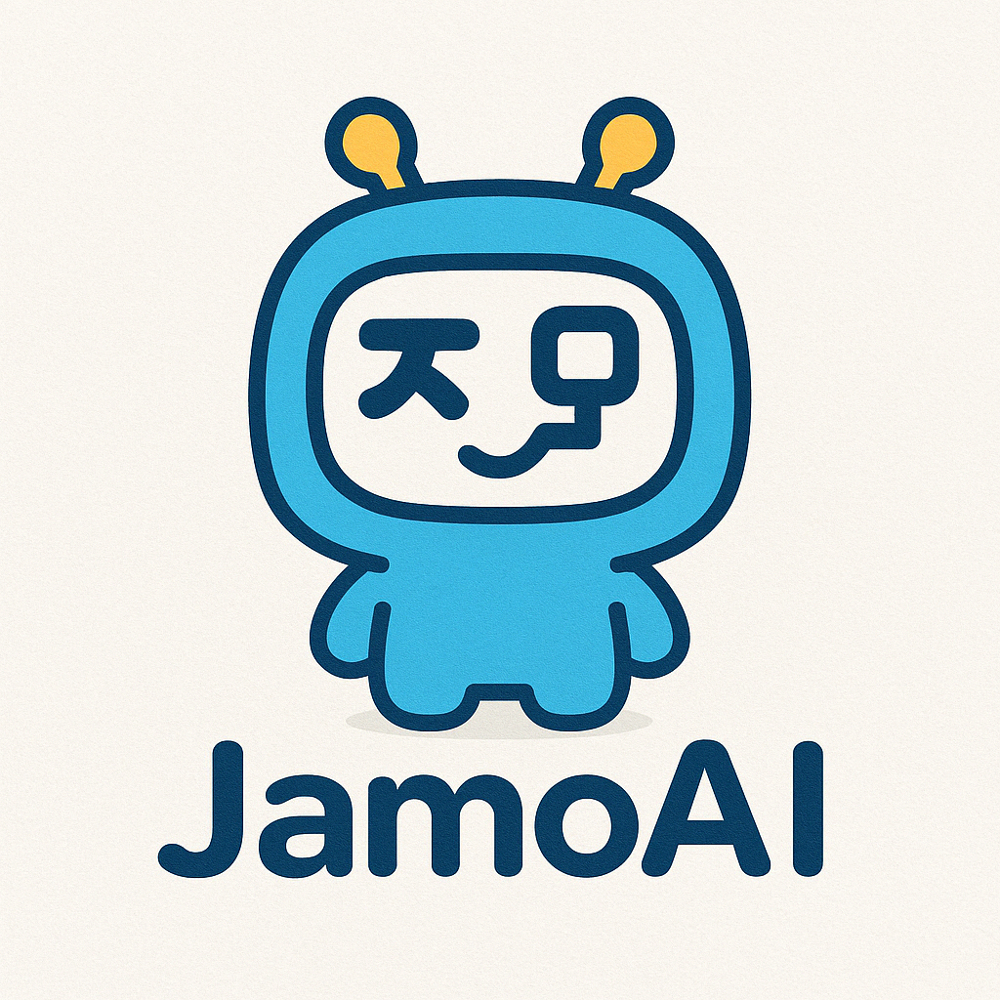
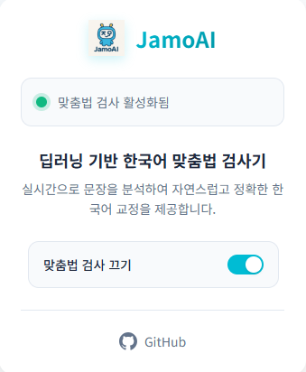

<table>
<tr>
<td width="80">
  
</td>
<td>
  <h2 style="margin-left: 10px;">JamoAI – 딥러닝 기반 한국어 맞춤법 검사기</h2>
</td>
</tr>
</table>

## 1. 프로젝트명

**JamoAI**는 딥러닝 기반 한국어 맞춤법 교정 시스템으로, Chrome Extension 형태의 프론트엔드와 FastAPI 기반 백엔드 API 서버로 구성되어 있습니다.  
ET5 모델(`j5ng/et5-typos-corrector`)을 기반으로 자연스럽고 정확한 문장 교정을 제공합니다.

---

## 2. 프로젝트 설명

JamoAI의 프론트엔드는 실시간 한국어 맞춤법 교정을 사용자에게 직관적인 인터페이스로 제공합니다.  
Chrome 확장 프로그램 형태로 동작하며 백엔드 API는 Cloudtype 프록시를 거쳐 로컬 GPU 서버에서 작동합니다.

주요 특징:
- Chrome 확장에서 텍스트를 실시간 분석 및 교정
- 백엔드는 Cloudtype → ngrok → 로컬 GPU 구조
- 교정 API에 안전하게 요청을 전달하고 응답 처리

---

## 3. 목차

1. 프로젝트명  
2. 프로젝트 설명  
3. 목차  
4. 크롬 확장 기능 사용 방법  
5. 프론트엔드 예시 화면  
6. 개발 및 배포 참고 사항  
7. 팀원 및 참고 자료  
8. 라이센스  

---

## 4. 크롬 확장 기능 사용 방법

1. `manifest.json`이 포함된 폴더를 Chrome → 확장 프로그램 페이지 → "압축 해제된 확장 프로그램 로드"를 통해 등록  
2. 확장 아이콘을 클릭 후 텍스트 입력 → 맞춤법 검사 자동 적용  
3. 백엔드 API가 정상 연결되면 결과를 받아 실시간 반영

---

## 5. 프론트엔드 예시 화면

---

## 6. 개발 및 배포 참고 사항

- 백엔드는 `master` 브랜치에 구성됨
- 백엔드 구성: FastAPI + ngrok + Cloudtype 프록시
- 실시간 API 연동을 위해 API Key, RateLimit 등 보안 기능 포함

---

## 7. 팀원 및 참고 자료

- 개발자: 박원빈 [UrbanTour](https://github.com/urbantour0809)
- 참고 모델: [j5ng/et5-typos-corrector](https://huggingface.co/j5ng/et5-typos-corrector)

---

## 8. 라이센스

MIT License
